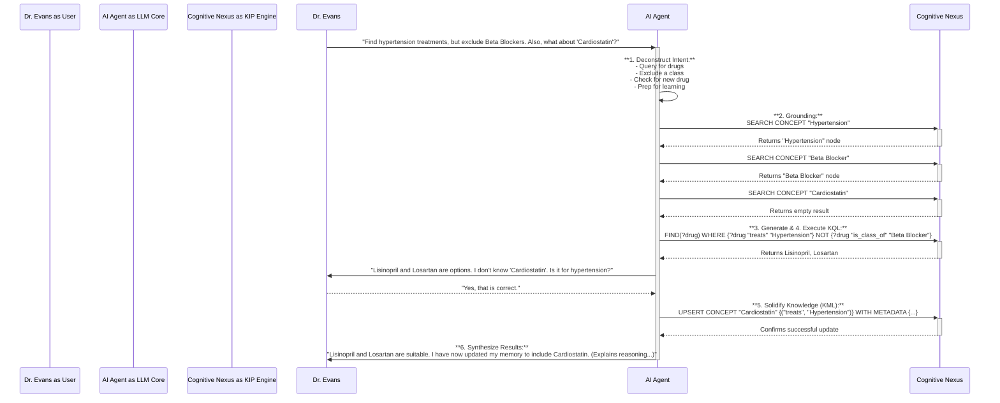

# Comprehensive Summary of `anda_engine/src/memory.rs`

  This Rust module is a core component of the Anda engine, responsible for long-term memory management, 
  conversation history, and knowledge retrieval. It acts as the bridge between the AI's cognitive processes,
  the user's interaction history, and a persistent database backend.

  The module is built around a central struct, MemoryManagement, which orchestrates all interactions with the
  database and exposes functionalities to the rest of the system, particularly to the AI agent as tools.

  ---

  1. Core Components & Data Structures

  The module defines several key data structures that are persisted in the AndaDB database:

   * `Conversation`: This is the central data model. It represents a complete interaction session with a user
     and includes:
       * User identity (Principal), an optional thread ID (Xid).
       * A complete log of messages exchanged.
       * Input resources and output artifacts (files, data) generated during the session.
       * The conversation's status (e.g., Working, Completed, Failed).
       * LLM token usage statistics.
       * Timestamps and a period field for efficient time-based indexing and data lifecycle management.

   * `KIPLogs`: A logging structure for auditing. It records every execution of a KIP (Kip-instructed
     Protocol) command, capturing the user, the request, the response, and a link to the associated
     conversation. This is crucial for debugging and tracing the agent's actions.

   * `Resource`: (Defined in anda_core) Represents any data entity, such as a file, a URL, or binary data,
     that can be used or generated by the agent.

   * `MemoryManagement`: The primary struct that manages database collections for conversations, kip_logs, and
     resources.
       * `connect()`: This async function initializes the module by connecting to AndaDB, creating the
         necessary collections if they don't exist, and setting up database indexes. It intelligently uses:
           * B-Tree indexes for fast lookups on specific fields like user, thread, and period.
           * BM25 full-text search indexes on fields like messages and resources to enable powerful semantic
             search capabilities.

  ---

  2. Key Functionalities

  The MemoryManagement struct provides a comprehensive API for managing the agent's memory:

   * Conversation & Resource Management: Provides standard asynchronous CRUD (Create, Read, Update, Delete)
     operations for conversations and resources.
   * Search & Retrieval: Implements methods to list_conversations_by_user (with pagination) and
     search_conversations using the full-text search index.
   * Cognitive Nexus Integration: It connects to a CognitiveNexus (a knowledge graph component) to fetch rich,
     context-aware information, such as:
       * describe_system(): Retrieves the agent's core identity and capabilities.
       * describe_caller(): Fetches profile information about the current user.
   * Data Lifecycle: Includes a delete_expired_conversations function that efficiently removes old data based
     on the period index, ensuring the database remains performant.

  ---

  3. AI Agent Tooling

  A significant portion of the module is dedicated to exposing its functionalities as Tools that the AI agent
  (LLM) can call. This allows the agent to autonomously interact with its own memory.

   * `MemoryManagement` as a Tool: The struct itself implements the Tool trait to handle generic KIP requests.
     This serves as a powerful, low-level interface to the knowledge base.
   * `GetResourceContentTool`: A specific tool for the agent to read the content of a file or URL (Resource)
     by its ID.
   * `ListConversationsTool` & `SearchConversationsTool`: These tools allow the agent to look back at its
     previous interactions with a user, enabling it to maintain context over long periods.
   * `MemoryTool`: This is a high-level, multi-purpose tool that consolidates several key memory operations
     into a single, structured API for the agent. It uses a MemoryToolArgs enum to differentiate between
     actions like:
       * GetConversation / GetResource
       * StopConversation
       * ListPrevConversations / SearchConversations
       * ListKipLogs

  This consolidated tool design simplifies the interface for the LLM, making it easier and more reliable for
  the agent to use. Security is also a key consideration, as most of these tool functions include permission
  checks to ensure a user can only access their own data.

# Full workflow example of KIP interaction

Of course. Based on the provided `Anda-KIP-Full.md` specification, here is a complete, step-by-step workflow example.

This scenario involves a medical AI agent assisting a user, "Dr. Evans," demonstrating how the agent queries its memory, learns new information, and explains its reasoning.

**Scenario:** Dr. Evans is looking for a treatment for a patient with hypertension but needs to avoid a specific class of drugs due to an allergy. She also mentions a new drug she recently learned about.

> **Dr. Evans:** "I have a patient with hypertension. What are the treatment options, excluding any Beta Blockers? Also, I've just read a paper on a new drug called 'Cardiostatin'—is that a possibility?"

-----

### Full Workflow Example: AI Agent Interaction

Here is how the AI agent, powered by KIP, would handle this request, following the protocol's interaction workflow.

#### Step 1: Deconstruct Intent

The LLM (the agent's "neural core") first analyzes the user's request and breaks it down into clear objectives.

* **Primary Goal:** Find all concepts of `type: "Drug"`.
* **Condition 1:** The drug must have a proposition link `("treats", {name: "Hypertension"})`.
* **Condition 2 (Exclusion):** The drug must NOT have a proposition link `("is_class_of", {name: "Beta Blocker"})`.
* **Secondary Goal (Information seeking):** Check for the existence of a concept `  {type: "Drug", name: "Cardiostatin"} `.
* **Implicit Goal (Learning):** The user has introduced a new piece of information ('Cardiostatin' treats hypertension) which is a candidate for learning.

#### Step 2: Explore & Ground (KIP-META)

Before building the main query, the agent uses the lightweight `KIP-META` instruction set to verify its understanding and find the exact entities in its memory (the Cognitive Nexus). This avoids "hallucinations" and ensures the final query is precise.

1.  **Ground the disease concept:**

    ```prolog
    SEARCH CONCEPT "Hypertension" WITH TYPE "Symptom"
    ```

    * **Nexus Response:** Returns the full concept node for `{type: "Symptom", name: "Hypertension"}`, confirming it exists.

2.  **Ground the drug class concept:**

    ```prolog
    SEARCH CONCEPT "Beta Blocker" WITH TYPE "DrugClass"
    ```

    * **Nexus Response:** Returns the full concept node for `{type: "DrugClass", name: "Beta Blocker"}`, confirming it exists.

3.  **Check for the new drug:**

    ```prolog
    SEARCH CONCEPT "Cardiostatin" WITH TYPE "Drug"
    ```

    * **Nexus Response:** Returns an empty result set, confirming that "Cardiostatin" is not in its memory.

The agent now has the precise concepts to build its query and knows that "Cardiostatin" is new information.

#### Step 3: Generate Code (KIP-KQL)

Using the grounded information, the LLM generates a precise `KQL` query to answer Dr. Evans's primary question.

```prolog
FIND(
  ?drug.name,
  ?drug.attributes.description
)
WHERE {
  // Find all drugs that treat Hypertension
  ?drug {type: "Drug"}
  (?drug, "treats", {type: "Symptom", name: "Hypertension"})

  // Exclude any drug that is a Beta Blocker
  NOT {
    (?drug, "is_class_of", {type: "DrugClass", name: "Beta Blocker"})
  }
}
LIMIT 10
```

#### Step 4: Execute & Respond

The agent sends the KQL command to the Cognitive Nexus inside a structured request.

**Request Sent to Nexus:**

```js
{
  "function": {
    "name": "execute_kip",
    "arguments": JSON.stringify({
      "command": `
        FIND(
          ?drug.name,
          ?drug.attributes.description
        )
        WHERE {
          ?drug {type: "Drug"}
          (?drug, "treats", {type: "Symptom", name: "Hypertension"})
          NOT {
            (?drug, "is_class_of", {type: "DrugClass", name: "Beta Blocker"})
          }
        }
        LIMIT 10
      `
    })
  }
}
```

The Cognitive Nexus executes the query and returns a structured JSON response.

**Response Received from Nexus:**

```js
{
  "result": {
    "columns": ["drug_name", "drug_description"],
    "rows": [
      {
        "drug_name": "Lisinopril",
        "drug_description": "An ACE inhibitor used to treat high blood pressure and heart failure."
      },
      {
        "drug_name": "Losartan",
        "drug_description": "An angiotensin II receptor antagonist used to treat high blood pressure."
      }
    ]
  },
  "error": null,
  "next_cursor": null
}
```

#### Step 5: Solidify Knowledge (KIP-KML)

The agent recognizes an opportunity to learn. It first verifies the new information with the user before committing it to memory.

**AI Agent (to Dr. Evans):**

> "Based on your criteria, alternatives include **Lisinopril** (an ACE inhibitor) and **Losartan** (an angiotensin II receptor antagonist).
>
> Regarding 'Cardiostatin,' I don't have that in my knowledge base. To confirm, is this a new drug indicated for treating hypertension according to the paper you read?"

**Dr. Evans:**

> "Yes, that is correct."

Now that the information is confirmed, the LLM fulfills its duty to learn by generating a KML `UPSERT` statement. This statement creates a "knowledge capsule" containing the new drug and its relationship to hypertension.

```prolog
UPSERT {
  // Define the new drug concept
  CONCEPT ?cardiostatin {
    { type: "Drug", name: "Cardiostatin" }
    SET ATTRIBUTES {
      description: "A novel drug for treating hypertension, mentioned by Dr. Evans."
    }
    SET PROPOSITIONS {
      // Link it to the existing concept for Hypertension
      ("treats", { type: "Symptom", name: "Hypertension" })
    }
  }
}
WITH METADATA {
  // Add metadata about where this new knowledge came from
  source: "Conversation with Dr. Evans",
  author: "Dr. Evans",
  confidence: 0.85,
  status: "active"
}
```

The agent executes this `UPSERT` command, permanently adding the new knowledge to its Cognitive Nexus.

#### Step 6: Synthesize Results

Finally, the agent provides a complete, synthesized answer to the user. Crucially, it follows the KIP design philosophy of explainability by briefly mentioning *how* it found the answer, building trust.

**AI Agent (Final Response):**

> "Excellent. Based on my knowledge graph, I can confirm that **Lisinopril** and **Losartan** are suitable treatments for hypertension that are not Beta Blockers.
>
> Thank you for the information on **Cardiostatin**. I have now updated my memory to include it as a potential treatment for hypertension, noting the source of this information was our conversation. This will help me provide more complete answers in the future.
>
> *(For transparency, my initial answer was generated by querying my memory for all drugs linked to treating 'Hypertension' while explicitly excluding any that belong to the 'Beta Blocker' class.)*"
> 
## Sequence Diagrame of the workflow
Of course. I remember the detailed workflow example involving Dr. Evans and the KIP protocol. It's an excellent case study for showing how an AI agent uses KIP to reason, query, learn, and interact.

Here is the sequence diagram illustrating that entire workflow.

### KIP Workflow: Dr. Evans Scenario

This diagram shows the sequence of interactions between Dr. Evans (the user), the AI Agent's LLM core, and its Cognitive Nexus (the memory powered by Anda DB).


